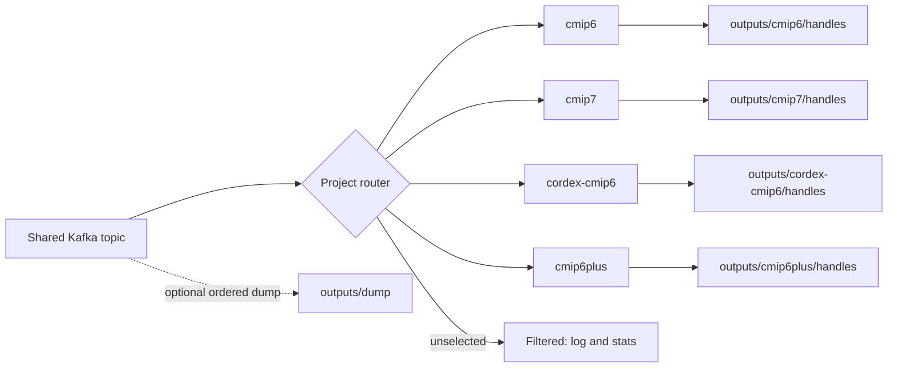

# Piddiplatsch

[](https://github.com/ESGF/piddiplatsch/actions)
[](LICENSE)
[](https://www.python.org/downloads/)
[](https://pre-commit.com/)

---

**Piddiplatsch** is a [Kafka](https://kafka.apache.org/) consumer for **ESGF STAC publication records** that integrates with the [Handle System](https://www.handle.net/) to reliably register and maintain persistent identifiers (PIDs).

*Curious by nature. Persistent by design.*

Inspired by the TV puppet [Pittiplatsch](https://en.wikipedia.org/wiki/Pittiplatsch), the name reflects more than wordplay.  
“Pitti” gives us the CLI name `piddi`, while the PID pun is purely phonetic. Like its namesake, Piddiplatsch is curious, persistent, and unafraid of a little chaos: it jumps into streaming data, handles errors head-on, and keeps going until the job is done.

---

## 🎯 Intended Audience

Piddiplatsch is developed for the **[ESGF](https://esgf.llnl.gov/)** (Earth System Grid Federation) community to support CMIP data ingestion and PID registration workflows. It is currently used in production at **DKRZ**.

It is intended for:
- ESGF data nodes managing CMIP6+ dataset and file records
- Sites that need to register or update PIDs via Handle.Net service
- Users comfortable running Kafka consumers in production environments

The project is fully open-source and documented. ESGF sites and other organizations with similar requirements are welcome to adopt and contribute.

---

## 🧭 Project support

CMIP6, CMIP6Plus, CMIP7, and CORDEX-CMIP6 are implemented as built-in project
plugins.

One consumer can read the shared ESGF publication topic and route records to one,
several, or all selected project plugins. Unrelated records are filtered without
being treated as failures. The plugins share the publication-envelope,
Handle-output schema, and mapping workflow; their small plugin modules declare
project identity, PID field names, and genuine project-specific behaviour.



---

## ⚡ Quick Start

Install, run, and test in minutes (CLI: `piddi`):

```bash
# 1) Setup environment
git clone git@github.com:ESGF/piddiplatsch.git
cd piddiplatsch
conda env create && conda activate piddi
make develop

# 2) Run tests
make test            # unit + integration

# 3) Run the consumer (requires Kafka + Handle)
piddi --help         # commands: consume, retry
piddi consume --help
piddi --verbose consume
```

**Prerequisites for real runs**

You need a Kafka broker and a Handle Service (or mock Handle server) available.  
For safe local exploration, you can use `--dry-run` or observe mode (see below).

---

## 🧪 Safe Exploration (Dry-Run & Observe)

Dry-run mode disables all Handle Service writes:

```bash
piddi --config custom.toml --verbose consume --dry-run
# optionally also dump messages
piddi --config custom.toml --verbose consume --dry-run --dump
```

### Observe Mode (Example)

For exploratory runs without external dependencies, use the relaxed example config:

```bash
#copy and run locally
cp etc/observe.toml .
piddi --config observe.toml consume --dry-run --dump --force
```

What this does:
- no external Handle Service calls
- records written to `outputs/<plugin>/handles/` as JSONL
- continues through transient skips (`--force`)
- dumps incoming messages to `outputs/dump/` when `--dump` is used

See the configuration at [etc/observe.toml](etc/observe.toml).

---

## ✨ Features

- Kafka consumer and project router for the shared ESGF publication stream
- Register and update PIDs via Handle Service
- CLI commands: `consume`, `retry`
- Multihash checksum support
- Explicit built-in project plugin registry (pure Python, no dynamic framework)
- Select one, several, or all registered project plugins

For full usage details and local Docker smoke tests, see [CONTRIBUTING.md](CONTRIBUTING.md).

---

## 🚀 Usage (Overview)

Common first runs:

- Inspect messages only:
  ```bash
  piddi consume --dry-run --dump
  ```
- Observe without stopping on skips:
  ```bash
  piddi consume --dry-run --force
  ```
- Override configured projects for one run:
  ```bash
  piddi consume --project cmip6
  piddi consume --project cmip6 --project cmip7
  piddi consume --all-projects
  ```
- Use a custom configuration:
  ```bash
  piddi --config custom.toml consume
  ```

### Status Bar (Verbose Mode)

Use `-v` or `--verbose` to display a live progress bar:

```bash
piddi -c custom.toml -v consume
```

Status line format:
```
cmip6   | msg:458 (22.69/s)| hdl:1.8k (88.79/s)| E:0| W:1.3k| D:70| replica:64| skip:0| patch:152| last_err:-- | ⏱ 00:00:20
```

- **msg**: messages processed (rate/s)
- **hdl**: handles registered (rate/s)
- **E**: errors, **W**: warnings, **D**: retracted messages
- **replica**: datasets with replica nodes (alternate locations)
- **skip**: messages skipped (transient external errors, e.g., STAC unavailable)
- **patch**: messages processed as JSON patches (incremental updates)
- **last_err**: time since last error
- **⏱**: total elapsed time

Detailed CLI options and extended examples live in [CONTRIBUTING.md](CONTRIBUTING.md).

Operational guidance for output retention, retries, logging, and shutdown is in
[docs/operations.md](docs/operations.md).

---

## 🛠️ Configuration

Start from the default configuration:

```bash
cp src/piddiplatsch/config/default.toml custom.toml
vim custom.toml
```

Run with your custom configuration:

```bash
piddi --config custom.toml
```

Kafka, Handle Service, consumer behaviour, and project selection are all controlled via this file.
See [docs/configuration.md](docs/configuration.md) for the supported application
settings and override behavior.

### ESGF Example Config

For non-Docker ESGF Kafka setups, copy the minimal override from [etc/esgf-example.toml](etc/esgf-example.toml) to `custom.toml` and edit your real ESGF options locally (do not commit secrets):

```bash
# Copy example and edit your ESGF Kafka settings
cp etc/esgf-example.toml custom.toml
vim custom.toml   # set brokers, group.id, SASL, CA path, etc.

# Validate and inspect
piddi --config custom.toml config validate
piddi --config custom.toml config show

# Safe test run (no Handle writes; dumps messages)
piddi --config custom.toml --verbose consume --dry-run --dump
```

This keeps your private ESGF credentials local while enabling safe end-to-end testing with `--dry-run` and `--dump`.

### Validate Config

```bash
piddi --config custom.toml config validate
```

Exits non-zero on errors; prints warnings when applicable.

### Show Effective Config

```bash
piddi --config custom.toml config show           # TOML
piddi --config custom.toml config show --format json
piddi --config custom.toml config show --section consumer
piddi --config custom.toml config show --section kafka --key group.id
```

Prints the merged defaults + your overrides for quick inspection.

---

## 🔄 Recovery & Retry

Piddiplatsch persists problematic records for later inspection or retry.

Failure records are written to:

```
outputs/failures/r<N>/failed_items_<date>.jsonl
```

Skipped (transient) records are written to:

```
outputs/skipped/skipped_items_<date>.jsonl
```

Dumped messages are written to:

```
outputs/dump/dump_messages_<date>.jsonl
```

Retry previously persisted items:

```bash
piddi retry <path...> [--delete-after] [--dry-run] [-v]
```

Implementation details:
- Retry logic: [src/piddiplatsch/persist/retry.py](src/piddiplatsch/persist/retry.py)
- Recorders: `src/piddiplatsch/persist/`

---

## 🧩 Project plugins (Overview)

Piddiplatsch uses a small, explicit plugin interface and a router in front of
project-specific processors.

This is **not currently** a dynamic plugin ecosystem. Plugins organize built-in
project code through a deliberately small interface. The mechanism exists to:
- isolate project-specific logic
- allow further ESGF projects to be added cleanly
- keep testing and evolution predictable

The same plugin specification can later become the boundary for external Python
packages discovered through standard package entry points, without adding that
complexity today.

Currently implemented project plugins are:

- `cmip6` (default)
- `cmip6plus`
- `cmip7`
- `cordex-cmip6`

The raw dump stays global to preserve Kafka order. JSONL Handle output is
project-scoped, and `pid.log` records selected and filtered projects.

Configuration and implementation guidance are documented in [CONTRIBUTING.md](CONTRIBUTING.md).
The message flow and consumer-group constraints are documented in
[docs/architecture.md](docs/architecture.md).

---

## 🧪 Testing

Quick commands:
- All tests (unit + integration): `make test`
- Unit only: `make test-unit`
- Integration only: `make test-integration`
- Smoke tests (Docker): `make test-smoke`

Full development and testing guidance is in [CONTRIBUTING.md](CONTRIBUTING.md).

---

## 🤝 Contributing

Interested in contributing?  
See [CONTRIBUTING.md](CONTRIBUTING.md) for development setup, testing, style, and workflow.
