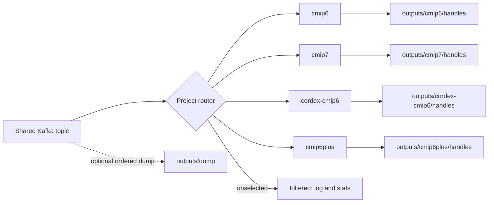

# Piddiplatsch

[](https://github.com/ESGF/piddiplatsch/actions)
[](LICENSE)
[](https://www.python.org/downloads/)
[](https://pre-commit.com/)

---

**Piddiplatsch** is a [Kafka](https://kafka.apache.org/) consumer for **ESGF STAC publication records** that integrates with the [Handle System](https://www.handle.net/) to reliably register and maintain persistent identifiers (PIDs).

*Curious by nature. Persistent by design.*

Inspired by the TV puppet [Pittiplatsch](https://en.wikipedia.org/wiki/Pittiplatsch), the name reflects more than wordplay.  
“Pitti” gives us the CLI name `piddi`, while the PID pun is purely phonetic. Like its namesake, Piddiplatsch is curious, persistent, and unafraid of a little chaos: it jumps into streaming data, handles errors head-on, and keeps going until the job is done.

---

## 🎯 Intended Audience

Piddiplatsch is developed for the **[ESGF](https://esgf.llnl.gov/)** (Earth System Grid Federation) community to support CMIP data ingestion and PID registration workflows. It is currently used in production at **DKRZ**.

It is intended for:
- ESGF data nodes managing CMIP6+ dataset and file records
- Sites that need to register or update PIDs via Handle.Net service
- Users comfortable running Kafka consumers in production environments

The project is fully open-source and documented. ESGF sites and other organizations with similar requirements are welcome to adopt and contribute.

---

## 🧭 Project support

CMIP6, CMIP6Plus, CMIP7, and CORDEX-CMIP6 are implemented as built-in project
plugins.

One consumer can read the shared ESGF publication topic and route records to one,
several, or all selected project plugins. Unrelated records are filtered without
being treated as failures. The plugins share the publication-envelope,
Handle-output schema, and mapping workflow; their small plugin modules declare
project identity, PID field names, and genuine project-specific behaviour.



---

## ⚡ Quick Start

Install, run, and test in minutes (CLI: `piddi`):

```bash
# 1) Setup environment
git clone git@github.com:ESGF/piddiplatsch.git
cd piddiplatsch
conda env create && conda activate piddi
make develop

# 2) Run tests
make test            # unit + integration

# 3) Harvest and map from Kafka (Handle publication is deferred)
piddi --help         # commands: harvest, map, consume, publish, retry
piddi consume --help
piddi --verbose consume
```

**Prerequisites for real runs**

You need Kafka for `harvest` and `consume`. A Handle Service (or mock Handle
server) is required only for `publish` or `consume --publish`.

---

## 🧪 Safe Exploration and Staged Processing

The default `consume` path dumps every raw queue message before plugin routing,
then maps selected projects into Handle JSONL without contacting a Handle
Service:

```bash
piddi --config custom.toml --verbose consume
```

The same work can be separated. `harvest` only reads Kafka and writes raw JSONL;
`map` replays one or more dump files through the selected plugins:

```bash
piddi --config custom.toml harvest
piddi --config custom.toml map --date 2026-08-27
```

### Deferred Handle publication

The Kafka consumer writes prepared Handles to daily JSONL files while a
separate command publishes a closed file later. JSONL audit files are also
always written before direct `rest` or `pyhandle` publication. Configure the
Each project selects a named Handle profile containing its REST server, prefix,
and credentials. Keep site profiles and secrets in the same ignored local
configuration file.

For example, publish all project files from yesterday:

```bash
piddi --config custom.toml --verbose publish \
  --project cmip6 --date 2026-08-24
```

`--project` validates the complete selected batch before the first request. It
does not filter mismatches. Omit it to retain the generic publisher, including
support for intentionally mixed-project inputs.

The date form resolves files beneath the configured `consumer.output_dir`.
`map --date YYYY-MM-DD` selects the global raw dump; `publish --project NAME
--date YYYY-MM-DD` selects that project's Handle file. A path and `--date`
cannot be combined, and neither command guesses a date when both are omitted.

For a limited trial against the current file, cap the total number of attempted
Handles:

```bash
piddi --config custom.toml --verbose publish --limit 1000 \
  --project cmip6 --date 2026-08-25
```

Continue with the next batch by combining the offset and limit:

```bash
piddi --config custom.toml --verbose publish \
  --project cmip6 --date 2026-08-25 \
  --offset 1000 --limit 1000 --retries 3
```

Retries cover transient connection errors, timeouts, rate limiting, and server
errors. The delay starts at one second and doubles for each retry; customize it
with `--retry-delay`. Permanent client errors such as invalid credentials are
not retried. Use `--workers N` for bounded concurrent PUT requests. Updates for
the same Handle remain in input order while different Handles are published in
parallel. Verbose progress shows both the absolute Handle position and its
position within the selected batch. Publication outcomes are written to the
standard log file (`pid.log` by default) and to a run-scoped structured JSONL
receipt under `outputs/published/`. The CLI prints the exact receipt path when
the run finishes. Each line includes the outcome, action, PID, full URL,
project, dataset, asset, source location, batch position, retries, and error.
Pass the existing global `--verbose` option to enable the terminal progress
bar; without it, only the final summary is printed.

Single-project batches are inferred automatically. Their receipt uses a name
such as `published_cmip6_handles_2026-08-28_10-15-00.jsonl`; mixed or unknown
batches retain the generic `published_handles_...jsonl` name. The final summary
shows totals for every project present.

You can also pass one file, several files, or a directory. `publish` never
changes or deletes its inputs. Publication uses Handle overwrite semantics, so
an immutable file can safely be run again after an interruption. The command
continues after individual Handle failures, prints a summary, and exits non-zero
if any Handle could not be published.

---

## ✨ Features

- Kafka consumer and project router for the shared ESGF publication stream
- Register and update PIDs via Handle Service
- CLI commands: `consume`, `publish`, `retry`
- Multihash checksum support
- Explicit built-in project plugin registry (pure Python, no dynamic framework)
- Select one, several, or all registered project plugins

For full usage details and local Docker smoke tests, see [CONTRIBUTING.md](CONTRIBUTING.md).

---

## 🚀 Usage (Overview)

Common first runs:

- Inspect messages only:
  ```bash
  piddi harvest
  ```
- Observe without stopping on skips:
  ```bash
  piddi consume --force
  ```
- Replay a saved dump through the configured plugins:
  ```bash
  piddi map --date 2026-08-27
  ```
- Harvest, map, and publish immediately:
  ```bash
  piddi consume --publish
  ```
- Override configured projects for one run:
  ```bash
  piddi consume --project cmip6
  piddi consume --project cmip6 --project cmip7
  piddi consume --all-projects
  ```
- Use a custom configuration:
  ```bash
  piddi --config custom.toml consume
  ```

### Status Bar (Verbose Mode)

Use the global `-v` or `--verbose` option to display live progress for
`harvest`, `map`, `consume`, or `publish`:

```bash
piddi -c custom.toml -v consume
piddi -c custom.toml -v map --date 2026-08-27
```

Status line format:
```
cmip6   | msg:458 (22.69/s)| hdl:1.8k (88.79/s)| E:0| W:1.3k| D:70| replica:64| skip:0| patch:152| last_err:-- | ⏱ 00:00:20
```

- **msg**: messages processed (rate/s)
- **hdl**: handles registered (rate/s)
- **E**: errors, **W**: warnings, **D**: retracted messages
- **replica**: datasets with replica nodes (alternate locations)
- **skip**: messages skipped (transient external errors, e.g., STAC unavailable)
- **patch**: messages processed as JSON patches (incremental updates)
- **last_err**: time since last error
- **⏱**: total elapsed time

Detailed CLI options and extended examples live in [CONTRIBUTING.md](CONTRIBUTING.md).

Operational guidance for output retention, retries, logging, and shutdown is in
[docs/operations.md](docs/operations.md).

---

## 🛠️ Configuration

Start from the default configuration:

```bash
cp src/piddiplatsch/config/default.toml custom.toml
vim custom.toml
```

Run with your custom configuration:

```bash
piddi --config custom.toml
```

Kafka, Handle Service, consumer behaviour, and project selection are all controlled via this file.
See [docs/configuration.md](docs/configuration.md) for the supported application
settings and override behavior.

### ESGF Example Config

For non-Docker ESGF Kafka setups, copy the minimal override from [etc/esgf-example.toml](etc/esgf-example.toml) to `custom.toml` and edit your real ESGF options locally (do not commit secrets):

```bash
# Copy example and edit your ESGF Kafka settings
cp etc/esgf-example.toml custom.toml
vim custom.toml   # set brokers, group.id, SASL, CA path, etc.

# Validate and inspect
piddi --config custom.toml config validate
piddi --config custom.toml config show

# Safe test run (no Handle writes; raw dump is automatic)
piddi --config custom.toml --verbose consume
```

This keeps your private ESGF credentials local while enabling safe staged testing.

### Validate Config

```bash
piddi --config custom.toml config validate
```

Exits non-zero on errors; prints warnings when applicable.

### Show Effective Config

```bash
piddi --config custom.toml config show           # TOML
piddi --config custom.toml config show --format json
piddi --config custom.toml config show --section consumer
piddi --config custom.toml config show --section kafka --key group.id
```

Prints the merged defaults + your overrides for quick inspection.

---

## 🔄 Recovery & Retry

Piddiplatsch persists problematic records for later inspection or retry.

Failure records are written to:

```
outputs/<project>/failures/r<N>/failed_items_<date>.jsonl
```

Skipped (transient) records are written to:

```
outputs/<project>/skipped/skipped_items_<date>.jsonl
```

Each record stores the canonical project in `__infos__.project`. Events whose
project cannot be resolved remain in the legacy global `failures/` or
`skipped/` directory.

Dumped messages are written to:

```
outputs/dump/dump_messages_<date>.jsonl
```

Retry previously persisted items:

```bash
piddi retry <path...> [--delete-after] [-v]
```

Retry remaps without contacting the Handle Service and writes a distinct batch
to `outputs/<project>/handles/retry_handles_<timestamp>.jsonl`. The command
prints every created path; publish only the recovered batch when it is ready:

```bash
piddi publish --project cmip6 outputs/cmip6/handles/retry_handles_<timestamp>.jsonl
```

Use `retry --publish` only when immediate publication is intentional.

Implementation details:
- Retry logic: [src/piddiplatsch/persist/retry.py](src/piddiplatsch/persist/retry.py)
- Recorders: `src/piddiplatsch/persist/`

---

## 🧩 Project plugins (Overview)

Piddiplatsch uses a small, explicit plugin interface and a router in front of
project-specific processors.

This is **not currently** a dynamic plugin ecosystem. Plugins organize built-in
project code through a deliberately small interface. The mechanism exists to:
- isolate project-specific logic
- allow further ESGF projects to be added cleanly
- keep testing and evolution predictable

The same plugin specification can later become the boundary for external Python
packages discovered through standard package entry points, without adding that
complexity today.

Currently implemented project plugins are:

- `cmip6` (default)
- `cmip6plus`
- `cmip7`
- `cordex-cmip6`

The raw dump stays global to preserve Kafka order. JSONL Handle output is
project-scoped, and `pid.log` records selected and filtered projects.

Configuration and implementation guidance are documented in [CONTRIBUTING.md](CONTRIBUTING.md).
The message flow and consumer-group constraints are documented in
[docs/architecture.md](docs/architecture.md).

---

## 🧪 Testing

Quick commands:
- All tests (unit + integration): `make test`
- Unit only: `make test-unit`
- Integration only: `make test-integration`
- Smoke tests (Docker): `make test-smoke`

Full development and testing guidance is in [CONTRIBUTING.md](CONTRIBUTING.md).

---

## 🤝 Contributing

Interested in contributing?  
See [CONTRIBUTING.md](CONTRIBUTING.md) for development setup, testing, style, and workflow.
