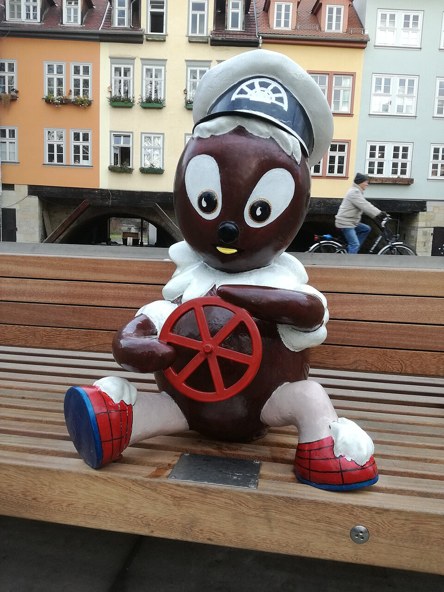

## Piddiplatsch in ESGF

**Project plugins map STAC publication records to validated Handle records.**

- Connects the ESGF-NG publication stream (with Kafka) to persistent identifier services.
- Prepares dataset and file records, including their relationships.
- Built-in plugins: **CMIP6, CMIP6Plus, CMIP7, and CORDEX-CMIP6**.
- Used in production at DKRZ; open source under Apache-2.0.

CLI: **`harvest` → `map` + validation → `publish`**, linked by **JSONL**.

[ESGF/piddiplatsch](https://github.com/ESGF/piddiplatsch)

::: notes
ESGF is the Earth System Grid Federation. STAC is the SpatioTemporal Asset
Catalog specification. PID means persistent identifier. Introduce Piddi as the
link between publication events and the Handle System, not a data publisher.
Source: repository README.md.
:::

## Why “Piddiplatsch”? {.name-slide}

::: columns
::: {.column width="62%"}

- Inspired by **Pittiplatsch**, the curious, mischievous puppet from German
  children's television, also known as **Pitti**.
- **PID** means persistent identifier: “Piddiplatsch” is a playful nod to the
  project's purpose.
- **`piddi`**, the CLI name, echoes the nickname “Pitti”.

*Curious by nature. Persistent by design.*

[Pittiplatsch on Wikipedia](https://en.wikipedia.org/wiki/Pittiplatsch)
:::

::: {.column width="34%"}
[{fig-alt="Pittiplatsch statue sitting on a railing in Erfurt" .pitti-photo}](https://commons.wikimedia.org/wiki/File:Pittiplatsch.jpg)

::: {.photo-credit}
Pittiplatsch statue in Erfurt. Photo: [Freddy123Hamster](https://commons.wikimedia.org/wiki/File:Pittiplatsch.jpg),
[CC BY-SA 4.0](https://creativecommons.org/licenses/by-sa/4.0/).
:::
:::
:::

::: notes
The project name explanation and motto come from the repository README.md.
The PID pun is phonetic. Character background:
https://en.wikipedia.org/wiki/Pittiplatsch.
The image used by that article is hosted on Wikimedia Commons:
https://commons.wikimedia.org/wiki/File:Pittiplatsch.jpg.
The image links to its description page, which includes the author and license.
The local copy is Wikimedia's 960-pixel thumbnail, displayed without cropping.
It shows a statue of the character, not the original television puppet.
:::

## Piddi in ESGF-NG {.architecture-slide}

```{mermaid}
%%{init: {"theme":"base","fontFamily":"Arial","fontSize":24,"themeVariables":{"fontSize":"24px","primaryColor":"#eef5f9","primaryBorderColor":"#457b9d","lineColor":"#457b9d"},"flowchart":{"htmlLabels":false,"curve":"linear"}}}%%
flowchart LR
    DN["Data nodes<br/>Files + publishing tools"] -->|STAC events| K["Publication API<br/>+ Kafka stream"]
    K --> STAC["Catalog consumers<br/>STAC East / West"]
    STAC -->|discovery| U["Users / clients"]
    DN -->|data access| U
    K --> P["Piddi<br/>Plugins + JSONL"]
    STAC -.->|lookup| P
    P -->|publish| H["Handle Service<br/>Dataset + file PIDs"]
    classDef focus fill:#457b9d,color:#fff,stroke:#24465c,stroke-width:3px;
    class P focus;
```

**Piddi maintains PIDs alongside catalog indexing; data files stay on data nodes.**

::: notes
Simplified logical view, not a deployment topology. The data-node box groups file hosting and publishing tools; the publication
box groups the transaction API and Kafka. Catalog consumers and their STAC
catalogs are grouped together. Catalog consumers and
Piddi independently consume publication events. Piddi may query STAC to recover
an item for PATCH processing or perform optional version lookup; STAC is not an
extra mandatory hop between Kafka and Piddi. Data access bypasses Piddi.
Sources: docs/architecture.md, docs/configuration.md;
https://github.com/ESGF/ESGF-Playground;
https://github.com/ESGF/stac-transaction-api;
https://talks.osgeo.org/foss4g-2026/talk/BDZP9T/.
:::

## Dataset and file identifiers

::: columns
::: {.column width="50%"}
### Dataset Handle

- Identifies a published dataset version.
- Records metadata and access information.
- Links to its file Handles with `HAS_PARTS`.
:::
::: {.column width="50%"}
### File Handle

- Uses the file's tracking identifier.
- Records file metadata and checksums.
- Links to the dataset with `IS_PART_OF`.
:::
:::

Project adapters resolve source PIDs; shared mapping builds the Handle records.

::: notes
The four project families declare their namespaced PID and tracking-ID fields.
CMIP6 also accepts known legacy fields. The optional force_dataset_pid policy
generates dataset identifiers from the full versioned STAC item ID; file
tracking identifiers remain unchanged. Avoid implying identifiers are always
newly minted by Piddi. Sources: docs/architecture.md and docs/configuration.md.
:::

## Project plugins: shared workflow, project rules {.plugins-slide}

```{mermaid}
%%{init: {"theme":"base","fontFamily":"Arial","fontSize":24,"themeVariables":{"fontSize":"24px","primaryColor":"#eef5f9","primaryBorderColor":"#457b9d","lineColor":"#457b9d"},"flowchart":{"htmlLabels":false,"curve":"linear"}}}%%
flowchart LR
    R["Project router"] --> C6["cmip6"]
    R --> CP["cmip6plus"]
    R --> C7["cmip7"]
    R --> CX["cordex-cmip6"]
    C6 --> V["Shared mapping<br/>+ Handle validation"]
    CP --> V
    C7 --> V
    CX --> V
    V --> O["Per-project<br/>Handle JSONL"]
```

- **Plugins own** project identity, PID fields, and project-specific behavior.
- **Core shares** routing, mapping machinery, validation, and JSONL persistence.
- Select one, several, or all built-in plugins; each event reaches at most one.

::: notes
Plugins are explicitly registered Python modules through PluginSpec, not
currently external packages discovered at runtime. Thin project adapters share
StacProjectProcessor and Pydantic Handle output models. CMIP6 version lookup is
an example of project-specific behavior. Unselected and unknown projects are
filtered and counted. Source: docs/architecture.md.
:::

## Three commands, connected by JSONL

| Command | Input | Work and output |
| --- | --- | --- |
| **`harvest`** | Kafka events | Save raw messages as **JSONL** |
| **`map`** | Raw JSONL | Route to plugins, map + validate → **Handle JSONL** |
| **`publish`** | Handle JSONL | Write to Handle Service → **receipt JSONL** |

```bash
piddi harvest --limit 100
piddi map --date last --project cmip6
piddi publish --project cmip6 --date last --limit 100
```

**JSONL = one JSON record per line:** inspect, retain, and replay each stage.

::: notes
Examples assume installed Piddi and configured site credentials; these code
blocks are never executed by Quarto. last selects the greatest valid date in
the relevant files. publish performs real Handle writes when run.
Map checks the publication envelope and consumed field shapes, then validates
the generated Handle records with Pydantic. It does not validate the complete
STAC schema. Schema strictness is configurable; it defaults to true.
Harvest preserves all raw events before project selection. Map writes one
Handle batch per project; publish each project's batch separately.
consume is the convenience path combining harvest and map; --publish enables
direct publication. Sources: README.md, docs/architecture.md,
docs/configuration.md.
:::

## Recovery and operational visibility

- **Replay:** retain the raw stream independently of project selection.
- **Recover:** save failed and skipped records for inspection and retry.
- **Audit:** keep prepared Handle JSONL and publication receipts.
- **Observe:** report progress, per-project statistics, and structured outcomes.

`piddi retry` prepares a separate recovered batch for explicit publication.

::: notes
Deferred publication retries transient failures with backoff, continues after
individual Handle failures, and exits non-zero if any Handle failed. A saved
immutable batch can be rerun with overwrite semantics. This is not an
exactly-once delivery claim. Sources: README.md and docs/operations.md.
:::

## Using Piddiplatsch

1. Configure Kafka, project selection, and a named Handle profile.
2. Validate configuration and prepare a small batch.
3. Inspect the output before publishing.
4. Run continuously with logs, retained output, and a recovery procedure.

**Project and documentation:**
[github.com/ESGF/piddiplatsch](https://github.com/ESGF/piddiplatsch)

::: notes
End the short overview here. The appendix supports operational questions.
Configuration, architecture, and deployment guides live in the repository.
:::

## Appendix: configuration

Packaged defaults → site configuration → local override

```text
src/piddiplatsch/config/default.toml
/etc/piddi/piddi.toml
./custom.toml
```

```bash
piddi config validate
piddi config explain --project cmip6
```

- `--config PATH` replaces the final local override.
- Named Handle profiles hold service settings and credentials.
- Keep real credentials in ignored local configuration.

::: notes
Validation runs offline; it does not test connectivity or credential validity.
Source: docs/configuration.md.
:::

## Appendix: consumer groups

**Kafka assigns partitions before Piddi filters projects.**

| Process arrangement | Consumer group choice |
| --- | --- |
| One process, several projects | One group |
| Separate processes for different projects | Distinct groups |

Sharing a group between separate CMIP6 and CMIP7 consumers can send an event to
the process that filters it out.

Changing project selection requires an explicit offset or replay decision.

::: notes
This follows Kafka partition assignment and Piddi's downstream filtering.
Source: docs/architecture.md, Kafka consumer groups.
:::

## Appendix: output and recovery

::: {.small}
```text
outputs/
  dump/dump_messages_<date>.jsonl
  <project>/
    handles/handles_<date>.jsonl
    failures/r<N>/failed_items_<date>.jsonl
    skipped/skipped_items_<date>.jsonl
  published/<run-scoped receipt>.jsonl
```
:::

- `map` reprocesses raw dumps with the chosen project selection.
- `retry` writes `retry_handles_<timestamp>.jsonl` in the project's handles folder.
- `publish` preserves its inputs and reports each attempted Handle's outcome.

::: notes
Unresolved projects retain global failure/skipped directories. Plan retention
for dumps, Handles, failures, logs, and receipts. Sources: README.md and
docs/operations.md.
:::
